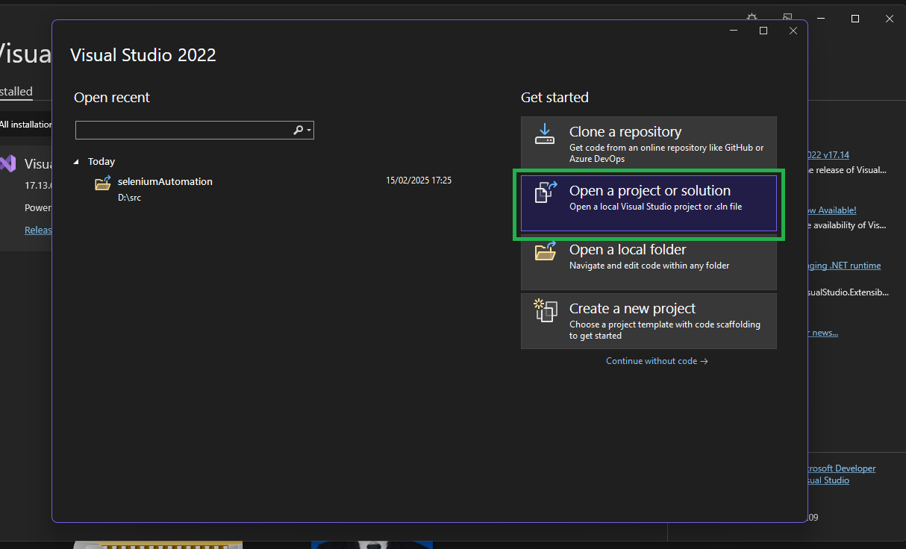
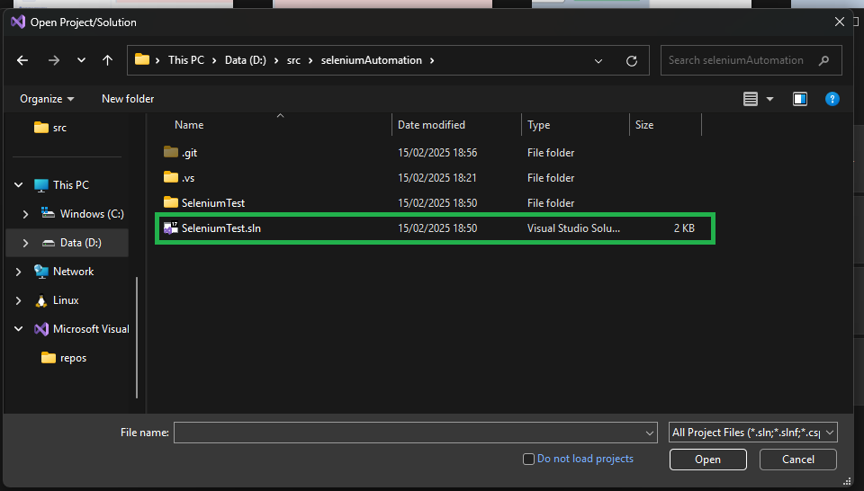
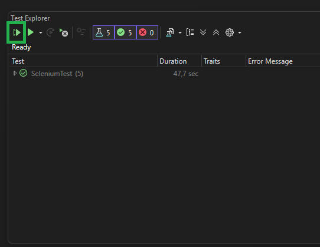
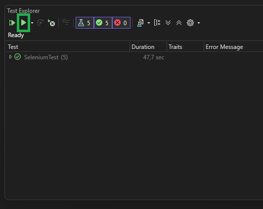
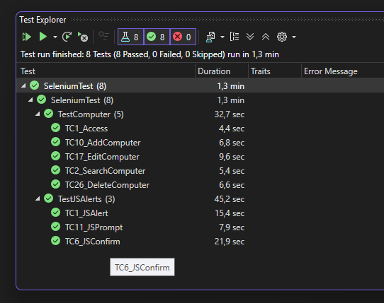

# Selenium Automation C#

This project is contains a selenium test using C# and NUnit. This automation test is a simple test:
1. [Computer database](http://computer-database.gatling.io/computers) testcase source [here](https://docs.google.com/spreadsheets/d/1ZVyqhysgfvGhT_QpKPI8rVxSzVEPdowT4Xjh_Kid0Zs/edit?gid=0#gid=0), but this automation test is only cover for following testcases:
    1. Access the computer database
    2. Search specific computer data
    3. Add new computer
    4. Edit existing computer
    5. Delete computer data
2. [Js Alert](http://computer-database.gatling.io/computers) testcase source [here](https://docs.google.com/spreadsheets/d/1ZVyqhysgfvGhT_QpKPI8rVxSzVEPdowT4Xjh_Kid0Zs/edit?gid=1264479048#gid=1264479048), but this automation test is only cover for following testcases:
    1. Trigger js alert pop-up
    2. Trigger js confirm pop-up
    3. Trigger js Prompt pop-up


## Requirements
- .NET version: 8.0
- Visual Studio 2022

Note: 
- .NET version must be version 8.0. Upgrade the version if in case your version is lower version
- Nuget package should be adjusted during build sln process
    - Try to run command ```restore``` on Tools → NuGet Package Manager → Package Manager Console

## How to run

### Prerequisites
1. Install Visual Studio 2022. [here](https://visualstudio.microsoft.com/downloads/) and make sure the installation including:
    1. .NET desktop development
2. Install .NET 8.0 [here](https://dotnet.microsoft.com/en-us/download/dotnet)
3. Clone repository

### Run the test
1. Open your visual studio
2. Choose Open project or solution
    
3. Go to repository path and select sln file
    
4. On the top menu of your visual studio 2022, click on **Test > Test Explorer**.
    - To run all testcases, click **Run All Tests** button.
        
    - To run specific case, click **Run** button.
        
    


### Result


